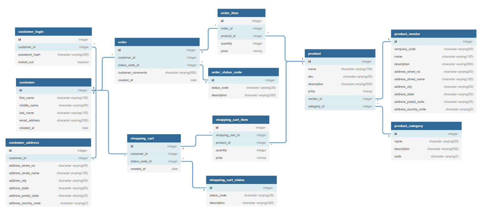

# The E-Commerce API

> The E-Commerce API is a fully-functioning REST API that allows users to perform various CRUD operations such as registering an account, browsing products for sale, etc.

## Table of contents

* [General info](#general-info)
* [Screenshots](#screenshots)
* [Technologies](#technologies)
* [Setup](#setup)
* [Features](#features)
* [Status](#status)
* [Inspiration](#inspiration)
* [Contact](#contact)

## General info

The purpose of this project is to help me to better understand Node.js, Express.js, postgreSQL, Swagger and to inspire people with valuable code.

## Screenshots



## Technologies

* JavaScript - version ES6
* ...

## Setup

Please use npm install & npm start to run the application in your local environment.

## Code Examples

Examples of API building blocks:

```javascript

//add code here

```

## Features

List of features ready and TODOs for future development

* ...

To-do list:

* ...

## Status

Project is: _wip_

## Inspiration

Thanks to XYZ for providing xyz.

## Contact

Created by [@pwagnerde](https://www.linkedin.com/in/pwagnerde/) - feel free to contact me!
